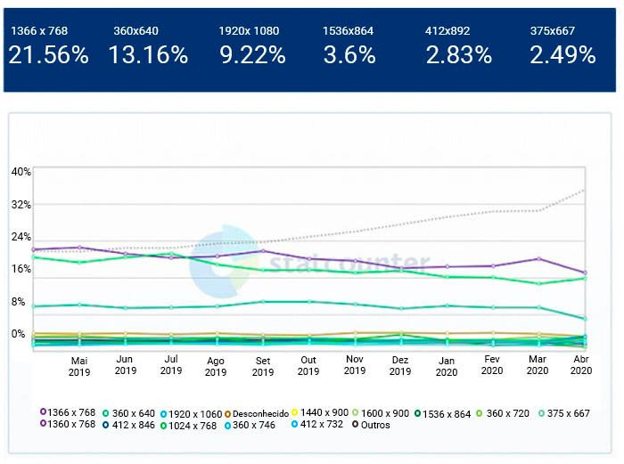

# 🔎 Visão Geral sobre Interfaces de Usuário

As **Interfaces de Usuário (UI)** representam a camada de interação entre pessoas e sistemas computacionais, funcionando como uma ponte essencial para facilitar o uso de aplicações, especialmente por usuários sem conhecimentos técnicos. Em um contexto onde a tecnologia está cada vez mais presente no cotidiano, é imprescindível que essas interfaces sejam **intuitivas, acessíveis e adaptáveis**, garantindo uma experiência fluida e consistente em diversos dispositivos — como desktops, tablets e smartphones.

O estudo das interfaces está inserido no campo da **Interação Humano-Computador (IHC)**, que investiga como os seres humanos interagem com sistemas computacionais e como esses sistemas podem ser projetados para melhorar essa interação. Historicamente, essa comunicação se dava por **linhas de comando**, exigindo domínio técnico. A evolução para as **Interfaces Gráficas de Usuário (GUI)** marcou uma mudança significativa, tornando o acesso mais visual e amigável.

Segundo Morais (2014), o foco inicial da computação era voltado ao hardware e software, com pouca atenção às necessidades humanas. Com a popularização dos dispositivos móveis e a democratização do acesso à tecnologia, houve uma virada de chave: passou-se a priorizar a **experiência do usuário (UX)**, com foco em **usabilidade, acessibilidade** e **responsividade**.

---

## 💡 A Interface no Contexto do Cliente

A crescente diversidade de dispositivos móveis, com distintas dimensões e resoluções de tela, exige interfaces **responsivas** — capazes de adaptar seu layout automaticamente, mantendo a legibilidade e funcionalidade independentemente do equipamento.

De acordo com Silva (2014), a usabilidade é um dos pilares centrais no design de interfaces modernas. Ela abrange não apenas a **facilidade de uso**, mas também a **curva de aprendizado** e a **eficiência da interação**. O **Design Responsivo (Responsive Design)** surge como solução para esse desafio, garantindo que aplicações web se ajustem de forma dinâmica a diferentes resoluções de tela.

---

## 📊 Dados Estatísticos: Resoluções de Tela

A seguir, apresentamos dados globais e nacionais sobre as resoluções de tela mais utilizadas entre abril de 2019 e abril de 2020, com base no **StatCounter Global Stats**.

### 🌐 Resoluções Mais Usadas no Mundo

| Resolução de Tela | Percentual de Uso |
| ----------------- | ----------------- |
| 360 x 640         | 10,11%            |
| 1366 x 768        | 9,69%             |
| 1920 x 1080       | 8,40%             |
| 375 x 667         | 4,24%             |
| 414 x 896         | 3,62%             |
| 1536 x 864        | 3,57%             |

### 🇧🇷 Resoluções Mais Usadas no Brasil

| Resolução de Tela | Percentual de Uso |
| ----------------- | ----------------- |
| 1366 x 768        | 21,56%            |
| 360 x 640         | 13,16%            |
| 1920 x 1080       | 9,22%             |
| 1536 x 864        | 3,60%             |
| 412 x 892         | 2,83%             |
| 375 x 667         | 2,49%             |

Esses dados revelam a predominância de resoluções voltadas tanto para **notebooks** quanto para **smartphones**, reforçando a necessidade de soluções responsivas que garantam acessibilidade e consistência na interface.

---

## 📈 Visualização Gráfica: Evolução das Resoluções (Brasil)

A imagem abaixo (ou gráfico embutido, conforme o meio de apresentação) mostra a evolução da participação das principais resoluções de tela no Brasil entre maio de 2019 e abril de 2020. As resoluções 1366x768 e 360x640 mantêm-se no topo, refletindo a dominância de notebooks e dispositivos móveis, respectivamente.

**Legenda do gráfico:**

- Roxo: 1366 x 768
- Verde-claro: 360 x 640
- Azul turquesa: 1920 x 1080
- Verde escuro: 1536 x 864
- Laranja: 412 x 892
- Vermelho: 375 x 667

O gráfico evidencia uma **estabilidade relativa** nas tendências de uso de resoluções, com pequenas variações ao longo do período analisado. Esses dados são fundamentais para orientar decisões de design e desenvolvimento front-end.

---

## ✅ Considerações Finais

A análise das resoluções de tela é um insumo estratégico no processo de desenvolvimento de interfaces modernas. A compreensão desses padrões permite **otimizar o design responsivo**, elevar os índices de usabilidade e melhorar a experiência geral do usuário.

Portanto, ao projetar interfaces, é fundamental considerar dados atualizados sobre o comportamento do usuário, garantindo que a solução proposta seja eficiente, adaptável e centrada no usuário.
