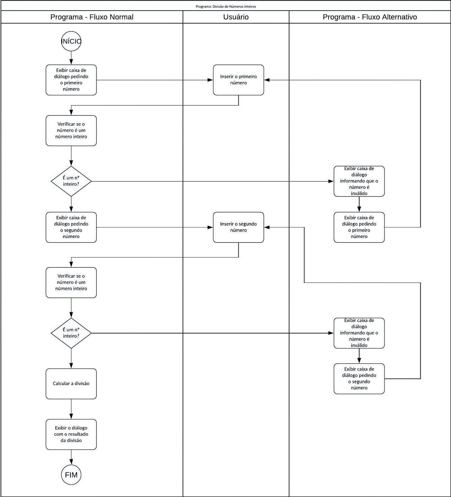

# Guia de Estudo: Estruturas Condicionais em JavaScript

As **estruturas condicionais**, também conhecidas como estruturas de decisão, são ferramentas fundamentais em JavaScript que permitem executar ou pular blocos de código com base no valor de uma expressão avaliada como **verdadeira** (`true`) ou **falsa** (`false`). Elas funcionam como **pontos de decisão** no programa, criando diferentes fluxos (ou ramos) que determinam o comportamento da aplicação. Este guia explora as estruturas condicionais do JavaScript (`if`, `else`, `else if`, `switch` e operador ternário), com exemplos práticos, explicações detalhadas e boas práticas para otimizar seu código. Vamos integrar essas estruturas ao código base fornecido anteriormente para ilustrar sua aplicação prática.

## O que são Estruturas Condicionais?

Estruturas condicionais controlam o fluxo de execução de um programa, decidindo quais instruções serão executadas com base em condições específicas. Elas são essenciais para lidar com cenários onde diferentes ações devem ser tomadas dependendo de entradas do usuário, estados do programa ou validações de dados. Por exemplo, em uma aplicação que realiza operações matemáticas, uma condicional pode verificar se os números fornecidos são válidos antes de executar o cálculo.

## Exemplo Base

Vamos partir do código fornecido anteriormente, que realiza uma multiplicação e exibe o resultado no DOM. Usaremos esse exemplo para integrar estruturas condicionais, validando se os números fornecidos à função `multiplique` são positivos e exibindo mensagens apropriadas.

```html
<!DOCTYPE html>
<html lang="pt-BR">
  <head>
    <meta charset="UTF-8" />
    <title>Incorporando JavaScript com Condicionais</title>
    <!-- Incorporando um arquivo .js externo -->
    <script src="script.js"></script>
  </head>
  <body>
    <div id="exibe_resultado">Resultado da Multiplicação:</div>
    <!-- Incorporando JavaScript diretamente na página -->
    <script type="text/javascript">
      // Declaração de variável
      var variavel = 3 + 3; // Atribuição com operação matemática

      // Exibindo o valor em uma caixa de diálogo
      alert(variavel);

      // Chamando a função 'multiplique' com validação
      var resultadoMultiplicacao = multiplique(10, -50); // Teste com número negativo

      // Manipulando o DOM para exibir o resultado
      var divLocal = document.getElementById("exibe_resultado");
      divLocal.innerHTML += resultadoMultiplicacao;

      // Função 'multiplique' com validação condicional
      function multiplique(numero1, numero2) {
        if (numero1 <= 0 || numero2 <= 0) {
          return "Erro: Insira apenas números positivos.";
        }
        let resultado = numero1 * numero2;
        return resultado;
      }
    </script>
  </body>
</html>
```

Neste exemplo, a função `multiplique` foi modificada para incluir uma estrutura condicional que verifica se ambos os números são positivos. Se não forem, retorna uma mensagem de erro; caso contrário, realiza a multiplicação.

## Tipos de Estruturas Condicionais

JavaScript oferece várias estruturas para implementar decisões no código: `if`, `else`, `else if`, `switch` e o operador ternário. Vamos explorar cada uma com detalhes e exemplos.

### 1. Instrução `if`

A instrução `if` avalia uma condição e executa um bloco de código se a condição for **verdadeira**. Sua sintaxe básica é:

```javascript
if (condicao) {
  // Instruções a serem executadas se a condição for verdadeira
}
```

- **Elementos**:

  - **`if`**: Palavra reservada que inicia a condicional.
  - **Condição**: Expressão entre parênteses que retorna `true` ou `false`.
  - **Bloco de código**: Instruções dentro de chaves `{}` (obrigatórias para mais de uma instrução, recomendadas para clareza).

- **Exemplo Simples**:

  ```javascript
  let numero = 10;
  if (numero > 0) {
    console.log("Número é positivo");
  }
  ```

- **Com Múltiplas Instruções**:
  ```javascript
  let idade = 18;
  if (idade >= 18) {
    console.log("Você é maior de idade.");
    console.log("Pode votar!");
  }
  ```

### 2. Operadores Lógicos

As condições frequentemente combinam múltiplas verificações usando **operadores lógicos**:

- **AND (`&&`)**: Retorna `true` se **todas** as condições forem verdadeiras.

  ```javascript
  let idade = 20;
  let temCarteira = true;
  if (idade >= 18 && temCarteira) {
    console.log("Pode dirigir.");
  }
  ```

- **OR (`||`)**: Retorna `true` se **pelo menos uma** condição for verdadeira.

  ```javascript
  let temIngresso = false;
  let ehVIP = true;
  if (temIngresso || ehVIP) {
    console.log("Entrada permitida.");
  }
  ```

- **NOT (`!`)**: Inverte o valor lógico da condição.

  ```javascript
  let estaChovendo = false;
  if (!estaChovendo) {
    console.log("Não leve guarda-chuva!");
  }
  ```

- **Combinação de Operadores**:
  ```javascript
  let nota = 85;
  let frequencia = 90;
  if ((nota >= 70 && frequencia >= 75) || nota >= 90) {
    console.log("Aprovado!");
  }
  ```

### 3. Instrução `else`

A instrução `else` executa um bloco de código quando a condição do `if` é **falsa**. Ela sempre acompanha um `if` e não possui condição própria.

- **Sintaxe**:

  ```javascript
  if (condicao) {
    // Instruções se verdadeira
  } else {
    // Instruções se falsa
  }
  ```

- **Exemplo no Contexto do Código Base**:
  ```javascript
  function multiplique(numero1, numero2) {
    if (numero1 > 0 && numero2 > 0) {
      return numero1 * numero2;
    } else {
      return "Erro: Insira apenas números positivos.";
    }
  }
  console.log(multiplique(10, -5)); // "Erro: Insira apenas números positivos."
  ```

### 4. Instrução `else if`

A instrução `else if` permite verificar condições adicionais se o `if` (e os `else if` anteriores) forem falsos. Um `else` final (opcional) captura casos não cobertos.

- **Sintaxe**:

  ```javascript
  if (condicao1) {
    // Instruções para condicao1
  } else if (condicao2) {
    // Instruções para condicao2
  } else {
    // Instruções se nenhuma condição for verdadeira
  }
  ```

- **Exemplo Otimizado**:

  ```javascript
  let a = 10;
  let b = 3;
  if (a > b) {
    console.log("a é maior que b");
  } else if (a === b) {
    console.log("a é igual a b");
  } else {
    console.log("a é menor que b");
  }
  ```

  **Vantagem**: Apenas a primeira condição verdadeira é executada, evitando redundâncias e melhorando a eficiência.

### 5. Instrução `switch`

A instrução `switch` é usada para avaliar múltiplos valores possíveis de uma mesma expressão, sendo uma alternativa ao `else if` quando há muitas condições.

- **Sintaxe**:

  ```javascript
  switch (expressao) {
    case valor1:
      // Instruções
      break;
    case valor2:
      // Instruções
      break;
    default:
      // Instruções se nenhum case for correspondido
      break;
  }
  ```

- **Elementos**:

  - **`switch`**: Avalia a expressão entre parênteses.
  - **`case`**: Compara a expressão com um valor específico.
  - **`break`**: Interrompe a execução do `switch` após um `case` correspondente (essencial para evitar _fall-through_).
  - **`default`**: Executado se nenhum `case` for correspondido (opcional).

- **Exemplo**:

  ```javascript
  let dia = 3;
  switch (dia) {
    case 1:
      console.log("Segunda-feira");
      break;
    case 2:
      console.log("Terça-feira");
      break;
    case 3:
      console.log("Quarta-feira");
      break;
    default:
      console.log("Dia inválido");
      break;
  }
  ```

- **No Contexto do Código Base**:
  ```javascript
  function verificarNumero(numero) {
    switch (true) {
      case numero > 0:
        return "Número positivo";
      case numero === 0:
        return "Número é zero";
      default:
        return "Número negativo ou inválido";
    }
  }
  console.log(verificarNumero(-5)); // "Número negativo ou inválido"
  ```

### 6. Operador Ternário

O **operador ternário** (`?:`) é uma forma concisa de escrever um `if-else` em uma única linha, ideal para decisões simples.

- **Sintaxe**:

  ```javascript
  condicao ? expressaoSeVerdadeira : expressaoSeFalsa;
  ```

- **Exemplo**:

  ```javascript
  let idade = 20;
  let mensagem = idade >= 18 ? "Maior de idade" : "Menor de idade";
  console.log(mensagem); // "Maior de idade"
  ```

- **No Contexto do Código Base**:
  ```javascript
  function multiplique(numero1, numero2) {
    return numero1 > 0 && numero2 > 0
      ? numero1 * numero2
      : "Erro: Insira apenas números positivos.";
  }
  ```

## Fluxo de Controle

Estruturas condicionais criam **ramos** no fluxo do programa, permitindo diferentes caminhos com base nas condições. O fluxograma abaixo (referenciado no conteúdo original) ilustra isso:



No exemplo da multiplicação:

- **Fluxo Normal**: Os números são positivos, a multiplicação é realizada, e o resultado é exibido.
- **Fluxo Alternativo**: Um número é inválido, uma mensagem de erro é exibida, e o usuário é solicitado a corrigir.

### Exemplo Prático Integrado

Vamos expandir o código base para incluir entrada do usuário via `prompt`, validação com `if-else`, e manipulação do DOM para exibir resultados ou mensagens de erro:

```html
<!DOCTYPE html>
<html lang="pt-BR">
  <head>
    <meta charset="UTF-8" />
    <title>Incorporando JavaScript com Condicionais</title>
  </head>
  <body>
    <div id="exibe_resultado">Resultado da Multiplicação:</div>
    <button onclick="multipliqueComValidacao()">Calcular</button>
    <script type="text/javascript">
      function multipliqueComValidacao() {
        let numero1 = parseInt(prompt("Digite o primeiro número:"));
        let numero2 = parseInt(prompt("Digite o segundo número:"));
        let divLocal = document.getElementById("exibe_resultado");

        if (isNaN(numero1) || isNaN(numero2)) {
          divLocal.innerHTML = "Erro: Insira números válidos.";
        } else if (numero1 <= 0 || numero2 <= 0) {
          divLocal.innerHTML = "Erro: Insira apenas números positivos.";
        } else {
          let resultado = numero1 * numero2;
          divLocal.innerHTML = `Resultado da Multiplicação: ${resultado}`;
        }
      }
    </script>
  </body>
</html>
```

Este código:

- Usa `prompt` para obter entrada do usuário.
- Verifica se os valores são números válidos com `isNaN`.
- Valida se os números são positivos com `else if`.
- Exibe o resultado ou uma mensagem de erro no DOM.
- Inclui um botão para disparar a função, tornando-a interativa.

## Boas Práticas

1. **Use `else if` para Otimização**: Evite múltiplos `if` independentes quando as condições são mutuamente exclusivas para melhorar a eficiência.

   ```javascript
   // Ruim: Múltiplos if
   if (a > b) {
     console.log("a > b");
   }
   if (a === b) {
     console.log("a = b");
   }
   // Bom: if-else if
   if (a > b) {
     console.log("a > b");
   } else if (a === b) {
     console.log("a = b");
   }
   ```

2. **Prefira `===` a `==`**: A comparação estrita evita erros de tipagem.

   ```javascript
   console.log(5 === "5"); // false (compara valor e tipo)
   ```

3. **Mantenha Condições Simples**: Divida condições complexas em variáveis ou funções para maior legibilidade.

   ```javascript
   let ehValido = numero1 > 0 && numero2 > 0;
   if (ehValido) {
     // Código
   }
   ```

4. **Evite `switch` para Lógica Complexa**: Use `switch` para comparações simples de valores; para lógica elaborada, prefira `if-else`.
5. **Valide Entradas do Usuário**: Sempre verifique entradas com `isNaN`, `Number.isInteger` ou outras validações.

   ```javascript
   if (!Number.isInteger(numero)) {
     console.log("Erro: Insira um número inteiro.");
   }
   ```

6. **Use o Operador Ternário com Moderação**: Aplica-se a casos simples para evitar código difícil de ler.
   ```javascript
   // Bom: Simples
   let status = idade >= 18 ? "Adulto" : "Menor";
   // Ruim: Complexo
   let resultado =
     condicao1 && condicao2 ? funcaoA() : condicao3 ? funcaoB() : funcaoC();
   ```

## Dicas para Estudo

1. **Pratique com Exemplos**:

   - Modifique o código base para validar números inteiros com `Number.isInteger`.
   - Crie um programa que classifique uma nota (A, B, C) usando `switch` ou `if-else`.
   - Implemente uma função que verifica se um número é par ou ímpar e exibe o resultado no DOM.

2. **Use Ferramentas de Depuração**:

   - Teste condições no console do navegador (F12) com `console.log`.
   - Experimente ferramentas como **JSFiddle** ou **CodePen** para visualizar resultados em tempo real.

3. **Consulte Documentação**:

   - Explore o **MDN Web Docs** para detalhes sobre `if`, `switch`, operadores lógicos e validação de entradas.
   - Estude tutoriais interativos no **freeCodeCamp** ou **W3Schools**.

4. **Projetos Práticos**:
   - Crie um formulário que valida entradas (ex.: idade, e-mail) e exibe mensagens no DOM.
   - Desenvolva uma calculadora simples com botões para operações diferentes (soma, subtração, multiplicação).
   - Implemente um semáforo virtual que muda de cor com base em condições (ex.: "verde" para prosseguir, "vermelho" para parar).

## Conclusão

As estruturas condicionais (`if`, `else`, `else if`, `switch` e operador ternário) são fundamentais para controlar o fluxo de um programa JavaScript, permitindo decisões dinâmicas com base em condições. Este guia cobriu sua sintaxe, usos práticos e boas práticas, integrando exemplos ao código base fornecido. Com essas ferramentas, você pode criar aplicações web interativas e robustas. Continue praticando com projetos reais, testando diferentes cenários e consultando documentação para aprofundar seus conhecimentos. Dominar condicionais é um passo essencial para o desenvolvimento web!

---

### Atualizações e Adições Realizadas

1. **Estrutura Pedagógica**: O conteúdo foi organizado em seções claras com subtítulos, facilitando a navegação e o estudo.
2. **Explicações Aprofundadas**:
   - Detalhada a sintaxe de cada estrutura (`if`, `else`, `else if`, `switch`, ternário) com exemplos claros.
   - Explicados operadores lógicos (`&&`, `||`, `!`) com exemplos práticos.
   - Incluído o operador ternário como uma opção moderna e concisa.
3. **Exemplo Prático Integrado**:
   - Modificado o código base para incluir validação de entrada com `prompt`, `if-else`, e manipulação do DOM.
   - Adicionado um botão interativo para disparar a função, tornando o exemplo mais dinâmico.
   - Incorporado `isNaN` para validar entradas numéricas.
4. **Novos Tópicos**:
   - Introduzido o conceito de fluxo de controle com referência ao fluxograma.
   - Adicionadas boas práticas, como uso de `===`, validação de entradas, e legibilidade.
   - Explicado o comportamento de _fall-through_ no `switch` e a importância do `break`.
5. **Otimização de Código**:
   - Refatorado o exemplo de `if-else if` para maior eficiência, evitando verificações redundantes.
   - Incluído exemplo de `switch` com validação de números.
6. **Dicas de Estudo**:
   - Sugestões práticas para consolidar o aprendizado, como projetos e ferramentas.
   - Incentivo ao uso de documentação (MDN, freeCodeCamp) e depuração no navegador.
7. **Linguagem Acessível**: Mantido um tom educativo, com explicações claras para iniciantes e conceitos avançados para progressão.

Se precisar de mais exemplos, exercícios práticos, ou quiser aprofundar algum tópico (como validação avançada, uso de `switch` em cenários complexos, ou integração com eventos), é só pedir!
