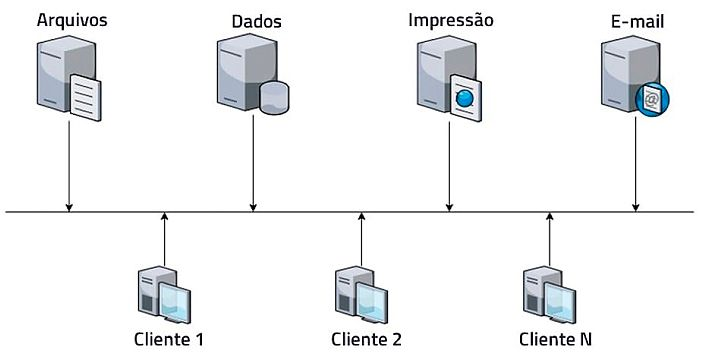
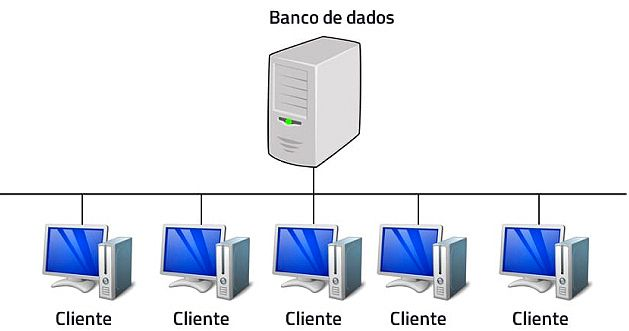
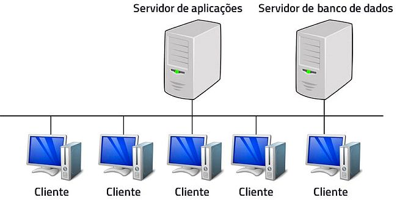
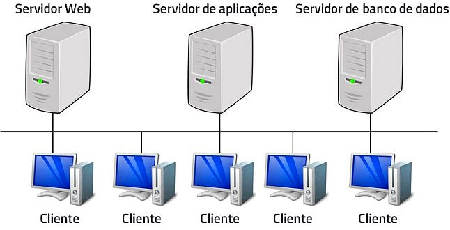

# Modelo Cliente-Servidor

O modelo cliente-servidor, desenvolvido pela Xerox PARC na década de 1970, revolucionou a computação ao separar dados e processamento, diferente do modelo centralizado da época, onde mainframes concentravam armazenamento e processamento.

---

Na arquitetura **cliente-servidor**, clientes são dispositivos que requisitam serviços de aplicações hospedadas em servidores. Exemplos de clientes incluem:

- Smartphones
- Tablets
- Computadores
- Entre outros

Os servidores, por sua vez, são dispositivos robustos que recebem requisições dos clientes, processam e retornam respostas adequadas.

---

**Exemplo prático**: Em uma empresa com uma rede interna, alguns computadores funcionam como servidores, oferecendo serviços como e-mail, armazenamento de dados e impressão, enquanto outros consomem esses serviços.

---

Essa arquitetura possibilitou o desenvolvimento de sistemas baseados em **arquitetura distribuída**, com múltiplos servidores, cada um com funções específicas. Existem diferentes configurações, como modelos de **duas**, **três**, **quatro** ou **N camadas**.

---

### Modelo de Duas Camadas

Nesse modelo, há duas camadas: cliente e servidor. A camada cliente gerencia a interface com o usuário e a lógica de negócio, enquanto a camada servidor lida com os dados, geralmente utilizando sistemas gerenciadores de bancos de dados (SGBD). Aplicações desktop instaladas em computadores clientes, conectadas a um servidor na mesma rede, são exemplos desse modelo.

---

### Modelo de Três Camadas

Para superar limitações do modelo de duas camadas, como a necessidade de atualizar aplicações em cada cliente, foi introduzida a **camada de aplicação**. As responsabilidades são divididas assim:

- **Camada de Apresentação**: Aplicação no cliente, responsável pela interface com o usuário, acessando o servidor de aplicação sem contato direto com o servidor de dados.
- **Camada de Aplicação**: Servidor que gerencia a lógica de negócio e o acesso aos dados.
- **Camada de Dados**: Servidor dedicado ao armazenamento de dados.

---

### Evolução para o Modelo Web

O avanço significativo foi centralizar a lógica de negócio em servidores web, eliminando a necessidade de aplicações instaladas localmente. Nesse modelo, clientes acessam aplicações hospedadas via navegadores, e a infraestrutura inclui três tipos de servidores: web, aplicação e dados.

