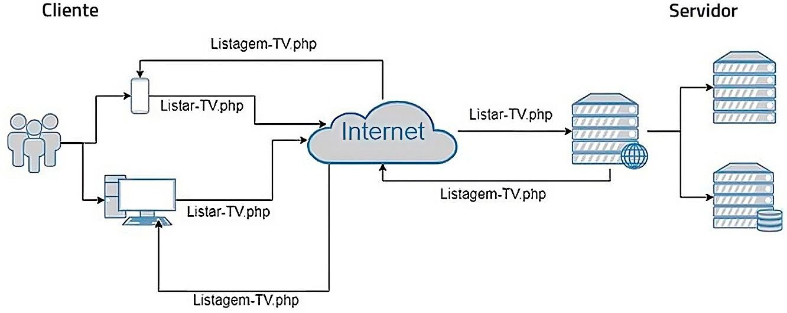

# **Arquitetura Web**

Nos modelos de 2 e 3 camadas, alterações na lógica de negócio exigem a reinstalação do software pelo cliente, o que é desafiador, pois muitos usuários da internet não têm o conhecimento técnico necessário para isso.

Para resolver essa questão, o modelo de 4 camadas foi criado, incorporando a camada Web na arquitetura `Cliente x Servidor`. Essa camada gerencia todas as atualizações, simplificando a experiência do cliente.

---

### **Cliente**

O cliente utiliza um navegador ou aplicativo para acessar serviços hospedados em um servidor web.

### **Servidor Web**

O servidor web pode reunir as camadas de apresentação, aplicação e dados em uma única máquina ou distribuí-las em várias, sendo essa estrutura transparente para o cliente.

---

## **Comunicação**

A comunicação é essencial nesse modelo, pois o cliente envia uma requisição que o servidor deve compreender e responder corretamente.

### **Comunicação no Ambiente Web**

No ambiente web, a comunicação ocorre pela internet, utilizando protocolos como o `HTTP (HyperText Transfer Protocol)`, responsável pela transferência de hipertexto. A imagem a seguir exemplifica esse processo:

> No exemplo, o cliente, por meio de um desktop ou smartphone, solicita um serviço via internet, representado pelo arquivo `Listar-TV.php`. O servidor web processa a requisição e retorna a resposta, representada pelo arquivo `Listagem-TV.php`. Esse fluxo sustenta aplicações web como sites de notícias, e-commerce, e-mails e redes sociais, onde o cliente faz uma solicitação e o servidor entrega o conteúdo requisitado.

### **Solicitação e Resposta**

A comunicação web segue o modelo de solicitação (`request`) e resposta (`response`). Normalmente, o cliente inicia a solicitação, mas o servidor também pode iniciá-la, como em serviços _push_, que enviam notificações aos clientes que optaram por recebê-las.

## **Client-side x Server-side**

Esses termos referem-se às tecnologias e códigos executados no lado do cliente (dispositivo do usuário que faz a requisição) e no lado do servidor (onde as requisições são processadas).
