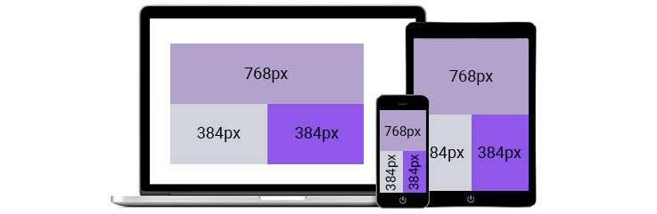
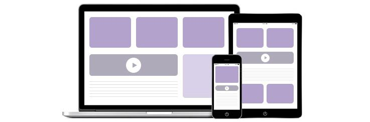

# O Conceito do Design Responsivo

No passado, as telas dos monitores utilizados nos computadores tinham tamanhos semelhantes. Entretanto, com o avanço da tecnologia e o surgimento de outros dispositivos, como notebooks, tablets e smartphones, há diversos tamanhos de telas e, sendo assim, é importante que os usuários possam acessar as páginas web de forma adequada independentemente do dispositivo que estejam utilizando.

Diante disso, surgiram conceitos como o **design responsivo**, em que as páginas web se adaptam ao tamanho de tela do dispositivo utilizado, proporcionando melhor experiência aos usuários. Essa abordagem implica layouts mais fluidos, em que os conteúdos podem ser exibidos de formas diferentes.

> Segundo Knight (2011), o design responsivo é a abordagem que sugere que o design e o desenvolvimento devam responder ao comportamento e ao ambiente do usuário com base no tamanho da tela, na plataforma e na orientação do dispositivo por ele utilizado.

Essa definição, na prática, implica que a página web/aplicação acessada deve ser capaz de, automaticamente, responder às preferências do usuário e, com isso, evitar que seja necessário construir diferentes versões de uma mesma página/aplicação para diferentes tipos e tamanhos de dispositivos.

---

## A Origem do Design Responsivo

O conceito de design responsivo teve sua origem no **projeto arquitetônico responsivo**. Tal projeto prega que uma sala ou um espaço deve se ajustar automaticamente ao número e fluxo de pessoas dentro dele. Para tanto, é utilizada uma combinação de robótica e tecnologia, como:

- sensores de movimento;
- sistemas de controle climático com ajuste de temperatura e iluminação;
- juntamente com materiais — estruturas que dobram, flexionam e expandem.

No ambiente web, da mesma forma que arquitetos não refazem um espaço físico para cada situação, **não devemos precisar construir uma nova versão da mesma página para cada tipo de visitante**. Isso evitaria custos com a criação de múltiplas versões, considerando a enorme variedade de tamanhos de tela e tecnologias.

---

## Design Responsivo na Prática

Ao aplicar o conceito de design responsivo, utilizamos uma combinação de técnicas, como:

1. Layouts fluidos;
2. Media queries;
3. Scripts.

Vamos entender cada uma dessas técnicas em detalhes.

### Layout Fixo

As dimensões (largura e altura) dos elementos de uma página web são definidos com a utilização de unidades fixas como `px` (pixels). Com isso, tais elementos não se adaptam às alterações no tamanho da tela.



### Layout Fluido

Os layouts fluidos utilizam unidades flexíveis. Em vez de definir que, por exemplo, o cabeçalho tenha 1366px de largura, podemos definir que ele ocupe 90% da tela.


**Outras unidades de medida flexíveis incluem:**

- **EM**: baseada na largura da letra "M" maiúscula. É relativa ao elemento pai.
- **REM**: baseada na tag raiz `<html>`. A unidade "R" refere-se à raiz (**root**).

> Além dessas, outras unidades estão disponíveis no site do W3C – CSS Units.

### CSS e Media Queries

As folhas de estilo (CSS) definem a apresentação da página: cores, dimensões, fontes etc. As **media queries** são expressões CSS que aplicam estilos apenas a certos tipos de dispositivos ou condições de tela.

**Exemplo de Media Query:**

```css
@media (max-width: 360px) {
  .menu_lateral {
    display: none;
  }
}
```

Neste exemplo, o menu lateral é ocultado em dispositivos com tela menor que 360px. A expressão será "verdadeira" se a condição for satisfeita. Caso contrário, os estilos definidos serão ignorados.

> **Atenção**: Media queries permitem expressões compostas, definição de tipos de mídia (ex: impressão) e escalas variadas.

---

## Scripts e JavaScript

**JavaScript**, principal linguagem de scripts no lado cliente, adiciona interatividade e atualização dinâmica ao conteúdo. Em design responsivo, ele é usado para:

- Atualizar elementos da interface conforme o dispositivo;
- Gerenciar conteúdos dinâmicos e animados;
- Ajustar apresentação de forma proativa.

---

## Design Responsivo vs Design Adaptativo

Apesar de semelhantes, os conceitos têm diferenças fundamentais:

### Design Responsivo

- Utiliza **media queries e scripts** para criar layouts fluídos;
- Adapta-se em tempo real a qualquer resolução;
- Requer planejamento técnico mais complexo;
- Flexível e eficiente para grande variedade de dispositivos.

### Design Adaptativo

- Usa **layouts estáticos com pontos de quebra definidos**;
- Para cada tamanho (ex: 360px, 720px, 1080px), carrega-se um layout específico;
- Menos flexível para tamanhos intermediários;
- Mais trabalhoso na fase de manutenção.

> Exemplo: Um dispositivo com 700px de largura receberia o layout de 360px — podendo gerar distorções.

---

## Abordagem Mobile First

**Mobile First** é uma abordagem centrada em dispositivos móveis. A lógica é:

1. Desenvolver primeiro para telas pequenas;
2. Adicionar recursos progressivamente para telas maiores.

Esse conceito se opõe à "**graceful degradation**", em que páginas são projetadas para desktops e depois adaptadas para smartphones.

**Mobile First prioriza:**

- Tamanho de tela;
- Banda disponível;
- Recursos nativos (ex: geolocalização).

---

## Considerações Finais

O design responsivo não é apenas uma tendência — é uma exigência no desenvolvimento web moderno. Ele garante acessibilidade, usabilidade, performance e otimização para SEO.

Dominar seus fundamentos é essencial para qualquer profissional de front-end ou desenvolvedor full stack que deseja entregar soluções completas e escaláveis.

Se desejar, posso gerar esse conteúdo em PDF, incluir imagens ilustrativas, diagramas ou criar uma apresentação para treinamento corporativo.

É só dar o sinal verde.
