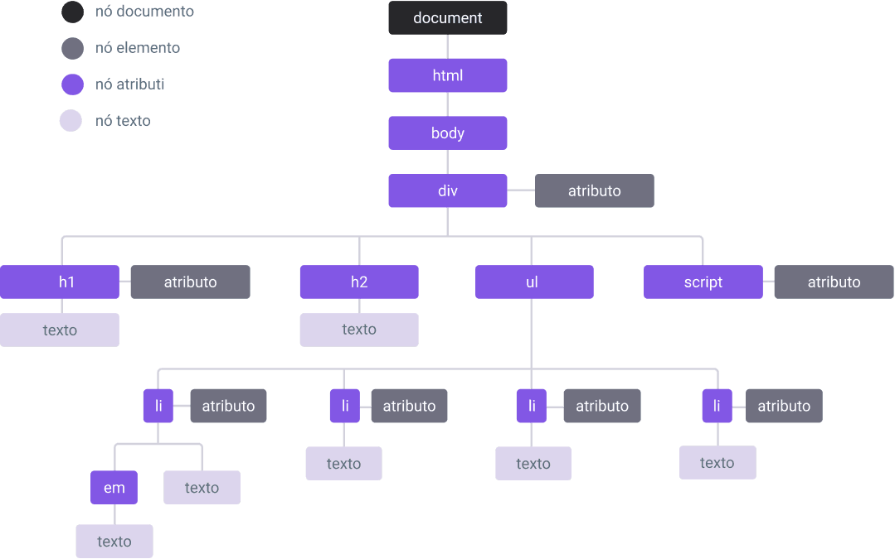

A seguir, apresento um conteúdo de estudo revisado, organizado e otimizado sobre a **Árvore DOM** e sua manipulação com **JavaScript**, estruturado para facilitar o aprendizado. Este material é baseado no texto fornecido, mas foi reformulado para servir como um guia claro e didático, com explicações detalhadas, exemplos práticos e linguagem acessível, ideal para estudantes de desenvolvimento web. O conteúdo mantém a essência do original, mas foi aprimorado para maior clareza, com adição de exemplos e uma estrutura mais pedagógica.

---

# Guia de Estudo: Árvore DOM e Manipulação com JavaScript

O **JavaScript** é uma das principais tecnologias do desenvolvimento web, ao lado do **HTML** e do **CSS**. Ele é executado no lado do cliente (navegador), permitindo criar páginas interativas e dinâmicas. Este guia explora como o JavaScript interage com a **Árvore DOM**, uma ferramenta essencial para manipular a estrutura, o conteúdo e o comportamento de páginas web.

## A Tríade do Desenvolvimento Web

As três tecnologias fundamentais do ambiente web têm papéis distintos e complementares:

- **HTML (HyperText Markup Language)**: Define a **estrutura** e o **conteúdo** de uma página, como títulos, parágrafos, imagens e links.
- **CSS (Cascading Style Sheets)**: Controla a **apresentação** visual, incluindo cores, fontes, layouts e animações.
- **JavaScript**: Adiciona **comportamento** e **interatividade**, permitindo que a página responda a ações do usuário, como cliques, rolagem ou preenchimento de formulários.

O JavaScript é uma linguagem **interpretada** e **multiparadigma**, com suporte a programação **estruturada**, **orientada a objetos** e **funcional**. Criado inicialmente para o ambiente web no lado cliente, hoje é usado também no **lado servidor** (com Node.js) e no desenvolvimento de **aplicativos móveis** (com frameworks como React Native).

> **Curiosidade**: Apesar da semelhança nos nomes, **JavaScript** e **Java** são linguagens completamente diferentes, sem relação técnica ou histórica.

## O que é a Árvore DOM?

A sigla **DOM** significa **Document Object Model** (Modelo de Objeto de Documento). O DOM é uma **interface de programação** que representa um documento web (como HTML ou XML) como uma **árvore de objetos**. Essa estrutura permite que linguagens como o JavaScript manipulem dinamicamente o conteúdo, a estrutura e os estilos de uma página.

### Características do DOM

- **Estrutura em Árvore**: O DOM organiza os elementos de uma página como uma hierarquia de **nós** (nodes). Cada nó pode ser um elemento HTML (como `<div>` ou `<p>`), texto, atributo (como `id` ou `class`) ou outro tipo de objeto.
- **Propriedades e Métodos**: Cada nó possui **propriedades** (como `textContent` para acessar o texto de um elemento) e **métodos** (como `appendChild` para adicionar um elemento).
- **Eventos**: O DOM permite associar ações a eventos do usuário, como cliques (`click`) ou teclas pressionadas (`keydown`).
- **Independência do JavaScript**: O DOM é uma especificação padrão definida pelo **W3C** (World Wide Web Consortium) e pode ser manipulado por outras linguagens, embora o JavaScript seja o mais comum no contexto web.

### Como Visualizar a Árvore DOM

Imagine um documento HTML simples:

```html
<!DOCTYPE html>
<html>
  <head>
    <title>Minha Página</title>
  </head>
  <body>
    <h1>Bem-vindo</h1>
    <p>Este é um parágrafo.</p>
  </body>
</html>
```

No DOM, esse documento é representado como uma árvore:

- **Raiz**: O nó `document`, que contém todo o documento.
- **Filhos**: O elemento `<html>`, que contém `<head>` e `<body>`.
- **Descendentes**: Dentro de `<body>`, há os elementos `<h1>` e `<p>`, cada um com seu texto como nós filhos.

A ilustração abaixo mostra a estrutura da árvore DOM:



## Manipulando o DOM com JavaScript

O JavaScript acessa e manipula o DOM por meio do objeto global **`document`**, que representa o documento HTML carregado no navegador. Com ele, é possível realizar diversas operações dinâmicas, como criar, modificar, remover elementos ou responder a interações do usuário.

### Principais Operações no DOM

1. **Acessar Elementos**:

   - Métodos como `document.getElementById()`, `document.querySelector()` ou `document.getElementsByClassName()` localizam elementos na página.
   - Exemplo: `const paragrafo = document.querySelector('p');` seleciona o primeiro `<p>`.

2. **Criar Novos Elementos**:

   - Use `document.createElement()` para criar elementos dinamicamente.
   - Exemplo: Criar uma nova `<div>` e adicioná-la ao `<body>`.

3. **Modificar Elementos**:

   - Alterar o conteúdo com `element.textContent` ou `element.innerHTML`.
   - Modificar atributos com `element.setAttribute()` ou propriedades como `element.className`.

4. **Remover Elementos**:

   - Use `element.remove()` para excluir um elemento da árvore DOM.

5. **Manipular Estilos**:

   - Acesse ou altere estilos com `element.style`, como `element.style.color = 'blue'`.

6. **Adicionar Eventos**:
   - Associe funções a eventos com `element.addEventListener()`, como cliques ou entradas de teclado.

### Exemplo Prático de Manipulação do DOM

Abaixo, um exemplo que cria um parágrafo dinamicamente, aplica um estilo e adiciona um evento de clique:

```javascript
// Criar um novo elemento <p>
const novoParagrafo = document.createElement("p");
novoParagrafo.textContent = "Este parágrafo foi criado com JavaScript!";

// Aplicar estilo
novoParagrafo.style.color = "blue";
novoParagrafo.style.fontSize = "18px";

// Adicionar ao <body>
document.body.appendChild(novoParagrafo);

// Adicionar um evento de clique
novoParagrafo.addEventListener("click", () => {
  alert("Você clicou no parágrafo!");
});
```

### Características da Manipulação do DOM

- **Dinâmica**: As alterações no DOM são refletidas imediatamente na página, sem necessidade de recarregá-la.
- **Temporária**: As mudanças existem apenas durante a sessão atual do usuário. Ao recarregar ou fechar a página, elas são perdidas, a menos que sejam persistidas (por exemplo, em um servidor ou no `localStorage`).
- **Interativa**: Permite criar experiências ricas, como formulários dinâmicos, menus interativos ou atualizações em tempo real.

## Dicas para Estudo

1. **Pratique com Exemplos Simples**:

   - Experimente criar, modificar e remover elementos em uma página HTML básica.
   - Use o console do navegador (tecla F12) para testar comandos como `document.querySelector()`.

2. **Explore Métodos do DOM**:

   - Consulte a documentação do MDN (Mozilla Developer Network) para aprender métodos como `appendChild()`, `remove()` e `addEventListener()`.

3. **Entenda Seletores**:

   - Pratique seletores CSS com `querySelector()` e `querySelectorAll()` para localizar elementos de forma eficiente.

4. **Teste Eventos**:

   - Adicione eventos como `click`, `mouseover` ou `input` para entender como o JavaScript responde a interações.

5. **Use Ferramentas de Desenvolvedor**:
   - Inspecione a árvore DOM no navegador (aba "Elements" no DevTools) para visualizar a estrutura da página e suas alterações.

## Conclusão

A **Árvore DOM** é a ponte que conecta o JavaScript ao HTML, permitindo que páginas web sejam dinâmicas e interativas. Compreender sua estrutura e aprender a manipulá-la com JavaScript é essencial para criar aplicações web modernas. Este guia cobriu os conceitos básicos e forneceu exemplos práticos para começar. Continue praticando com projetos reais e explorando a documentação para aprofundar seus conhecimentos!
