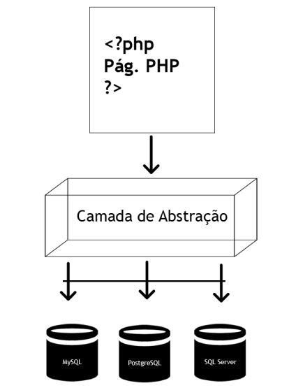

# A Classe PDO

A Classe PDO (PHP Data Objects) é uma ferramenta essencial para conectar aplicações PHP a bancos de dados, permitindo realizar operações CRUD (Create, Read, Update, Delete) de forma eficiente e padronizada. Abaixo, apresento uma versão revisada, organizada e aprimorada do conteúdo, com explicações claras, concisas e estruturadas, mantendo o conteúdo técnico e didático.

---

## Introdução ao PDO

Em projetos de desenvolvimento, lidamos com diversas linguagens de programação e sistemas de gerenciamento de banco de dados (SGBDs). Independentemente das tecnologias utilizadas, é fundamental compreender como conectar uma aplicação a um banco de dados para realizar operações CRUD, que incluem:

- **Criação** (Create): Inserir novos registros.
- **Leitura** (Read): Consultar dados existentes.
- **Atualização** (Update): Modificar registros.
- **Remoção** (Delete): Excluir dados.

A classe PDO, parte de uma extensão do PHP, oferece uma **interface leve e padronizada** para acesso a diferentes SGBDs, simplificando a interação com bancos de dados e reduzindo a dependência de funções específicas de cada sistema.

---

## O que é PDO?

**PDO** (PHP Data Objects) é uma classe da biblioteca PHP que fornece uma **camada de abstração** para acesso a bancos de dados. Isso significa que, com o PDO, é possível escrever código PHP que funcione com diferentes SGBDs (como MySQL, PostgreSQL, SQLite, entre outros) sem a necessidade de alterar significativamente o código ao trocar de banco.

### Principais Vantagens do PDO

- **Portabilidade**: Utilize os mesmos métodos e funções PDO, independentemente do SGBD.
- **Segurança**: Suporte a consultas preparadas (prepared statements), que ajudam a prevenir injeções SQL.
- **Flexibilidade**: Compatível com diversos bancos de dados por meio de drivers específicos.
- **Manutenção simplificada**: Ao mudar de SGBD, basta ajustar o driver no código, mantendo as demais funções inalteradas.

### Funcionamento

O PDO atua como uma camada intermediária entre a aplicação PHP e o banco de dados, como ilustrado na imagem abaixo:



Para usar o PDO, é necessário:

1. **Habilitar a extensão PDO** no servidor web.
2. **Instalar o driver específico** para o SGBD desejado (ex.: PDO_MYSQL para MySQL).

> **Dica**: A configuração da extensão PDO e dos drivers varia conforme o sistema operacional. Consulte tutoriais específicos na internet ou a seção **Explore +** para referências.

---

## Drivers PDO

O PDO suporta **12 drivers**, cada um correspondente a um SGBD específico. A tabela abaixo lista os drivers disponíveis e os bancos correspondentes:

| **Driver**   | **SGBD Suportado**                      |
| ------------ | --------------------------------------- |
| PDO_CUBRID   | Cubrid                                  |
| PDO_DBLIB    | FreeTDS / Microsoft SQL Server / Sybase |
| PDO_FIREBIRD | Firebird                                |
| PDO_IBM      | IBM DB2                                 |
| PDO_INFORMIX | IBM Informix Dynamic Server             |
| PDO_MYSQL    | MySQL 3.x/4.x/5.x                       |
| PDO_OCI      | Oracle Call Interface                   |
| PDO_ODBC     | ODBC v3 (IBM DB2, unixODBC, win32 ODBC) |
| PDO_PGSQL    | PostgreSQL                              |
| PDO_SQLITE   | SQLite 3 e SQLite 2                     |
| PDO_SQLSRV   | Microsoft SQL Server / SQL Azure        |
| PDO_4D       | 4D                                      |

---

## Conexão com Bancos de Dados usando PDO

Para conectar uma aplicação a um banco de dados com PDO, utilizamos o **construtor da classe PDO**, que cria uma instância de conexão. A sintaxe básica é:

```php
$dsn = new PDO("driver:host=endereco;dbname=nome_banco", $usuario, $senha);
```

### Exemplos de Conexão

Abaixo, exemplos de conexão com MySQL e PostgreSQL:

```php
// Conexão com MySQL
$dsn = new PDO("mysql:host=localhost;dbname=test", $usuario, $senha);

// Conexão com PostgreSQL
$dsn = new PDO("pgsql:host=localhost;dbname=test", $usuario, $senha);
```

### Explicação dos Parâmetros

- **driver**: Identifica o SGBD (ex.: `mysql`, `pgsql`).
- **host**: Endereço do servidor do banco de dados (ex.: `localhost`).
- **dbname**: Nome do banco de dados.
- **$usuario** e **$senha**: Credenciais de acesso ao banco.

### Configuração de Porta

Em redes, portas identificam aplicações ou processos. Cada SGBD utiliza uma porta padrão:

- **MySQL**: 3306
- **PostgreSQL**: 5432

Para especificar uma porta diferente da padrão, adicione o parâmetro `port` ao DSN:

```php
$dsn = new PDO("mysql:host=localhost;dbname=test;port=3307", $usuario, $senha);
```

---

## Benefícios da Camada de Abstração

Ao usar PDO, a troca de SGBD em um projeto exige apenas a alteração do **nome do driver** e, se necessário, parâmetros como porta ou credenciais. O restante do código (consultas, tratamento de resultados, etc.) permanece inalterado, garantindo:

- **Consistência**: Funções de execução de consultas e manipulação de dados são as mesmas para todos os SGBDs.
- **Eficiência**: Menos retrabalho ao migrar entre bancos de dados.
- **Escalabilidade**: Facilita a manutenção e evolução do projeto.

---

## Conclusão

A classe PDO é uma solução poderosa e flexível para integração de aplicações PHP com bancos de dados. Sua camada de abstração permite trabalhar com diferentes SGBDs de forma uniforme, reduzindo a complexidade do código e aumentando a segurança e portabilidade. Para começar a usar o PDO, certifique-se de habilitar a extensão e o driver correspondente ao seu SGBD no servidor.

> **Explore +**: Consulte a documentação oficial do PHP (php.net) ou tutoriais online para configurar a extensão PDO e drivers no seu ambiente.
